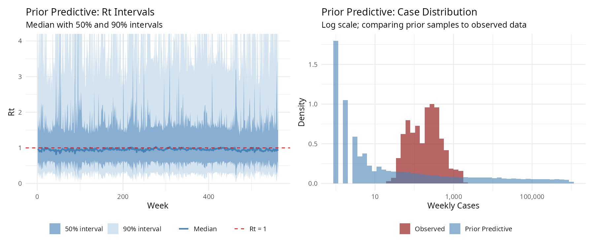

\begin{center}
\textbf{Word count:} 3{,}210 words (Introduction, Methods, Results, Discussion; excluding abstract, references, figure captions, code availability, and AI-use declaration)
\end{center}

\newpage

# Abstract {.unnumbered}

We develop a Bayesian renewal equation model for weekly dengue effective reproduction number ($R_t$) in Singapore (2012--2022), decomposing $\log R_t$ into climate covariates and a residual Gaussian process (GP) via a Hilbert Space approximation with a Mat\'ern 3/2 kernel. Climate explains less than 1\% of $R_t$ variance at weekly resolution; the residual GP captures 99.4\%. Post-hoc, 5 of 7 serotype switch events show elevated transmission (posterior probability $> 0.75$), serotype turnover leads $f_{\text{residual}}$ by ${\sim}8$ months ($r \approx 0.23$, exceeding the noise band), and the residual spectrum shows peaks at 26, 51, ${\sim}80$, and ${\sim}187$ weeks; the $\sim 3.6$-year peak is consistent with multi-annual oscillations generated by transient cross-immunity plus seasonal forcing. Conclusions are robust across four kernels. A retrospective decomposition of model-implied cases assigns $+4{,}419$ (95\% CrI: $2{,}925$ to $6{,}043$) to the GP component in the six months following the February 2020 DENV-3 emergence, the only switch with a clearly positive contribution. This is week-by-week accounting against the observed infectious pressure, not a causal or counterfactual claim. A direct test of the immunity-depletion hypothesis, adding explicit $\log S(t)$ covariates constructed by week-by-week cumulative-case depletion of an aggregate national pool or four per-serotype pools (across a sweep of initial susceptible fractions), fails to absorb the residual, so the mechanism remains uncertain. The GP also has fundamental limitations for operational forecasting: it fails to beat a random walk baseline at any horizon (CRPS $1.9\times$, $2.9\times$, $6.5\times$ worse at 4-, 8-, 13-week horizons), regressing to the mean once the horizon exceeds $\hat\rho \approx 3$ weeks.

\newpage

# Introduction {#sec-introduction}

Dengue is the most widespread mosquito-borne viral disease, with an estimated 390 million infections annually \citep{bhatt2013global}. Singapore experiences recurrent epidemics driven by climate, vector ecology, population immunity, and the sequential dominance of four serotypes (DENV-1--4) \citep{ang2018dengue}. Understanding the relative contributions of these drivers is essential for epidemic preparedness.

The effective reproduction number $R_t$ (average secondary infections per case at time $t$) is the central quantity for real-time epidemic assessment \citep{cori2013new}. Standard approaches (Cori's sliding-window method, EpiNow2's Gaussian process \citep{abbott2020estimating}) conflate all sources of $R_t$ variation into a single smooth function, precluding attribution to specific drivers.

We address this by decomposing $\log R_t$ into an additive linear predictor for measured covariates (climate) and a residual Gaussian process (GP) for unmeasured temporal structure. GPs provide principled Bayesian uncertainty over latent functions, admit additive decomposition with parametric covariates, and have interpretable kernel hyperparameters (length scale, amplitude), unlike black-box alternatives such as variational autoencoders or foundation models. The framework asks: conditional on climate, what residual structure remains in $R_t$, and does it align with serotype-driven immunity dynamics?

This report addresses five questions:

1. **Decomposition and accounting.** How is weekly $\log R_t$ partitioned between climate and the residual GP, and how many cases does the residual account for relative to a climate-only reference? (variance decomposition, retrospective residual decomposition)
2. **Serotype dynamics.** Does the residual coincide with serotype replacement events, and what lag and periodicity structure characterises it? (switch profiles, cross-correlation, spectral analysis, per-switch contribution)
3. **Robustness.** Are conclusions robust to climate lag and GP kernel choice? (lag and kernel sensitivity)
4. **Forecasting.** Can the framework provide skillful short-horizon forecasts? (CRPS against a random walk baseline)
5. **Outbreak risk.** How do $R_t$ fluctuations translate to outbreak sustaining probability? (branching process analysis)

# Methods {#sec-methods}

## Data Sources {#sec-data}

**Dengue cases.** Weekly notified cases for Singapore (January 2012--December 2022) were obtained from the MOH Weekly Infectious Diseases Bulletin via data.gov.sg. These are reported cases, subject to under-ascertainment of asymptomatic and mild infections, but dengue is notifiable and symptomatic/lab-confirmed cases are well-captured. After merging with weather, the dataset has $N = 568$ weeks, of which $N_{\text{model}} = 562$ are fit (first 6 weeks dropped as generation-interval burn-in).

**Climate covariates.** Weekly mean temperature and total rainfall were obtained from the Meteostat API (Changi Airport, WMO 48698), standardized, and lagged by 4 weeks to reflect \emph{Aedes} vector ecology (${\sim}2$--$3$ wk egg-to-biting adult) plus intrinsic incubation and onset-to-notification (${\sim}2$ wk). The extrinsic incubation period is embedded in the renewal equation's generation interval.

**Serotype proportions.** Monthly DENV-1--4 proportions (2013--2022) from NEA sequencing surveillance were smoothed with a multinomial logistic GAM \citep{finch2025climate} under the simplex constraint; denoising reduces ${\sim}23$ apparent month-to-month flips to 7 genuine replacement events. From the smoothed trajectories we derived dominant-serotype identity, switch events, Shannon entropy, and monthly \emph{turnover rate} (absolute change in the dominant serotype's proportion). Serotype data were used only post-hoc, not as in-model covariates, because they are (a) endogenous (computed from a subset of the same cases that generate $R_t$), (b) a biased, noisy monthly typed subset, and (c) underpowered with only $n = 7$ switch events occurring in the study period. Including serotype as an in-model covariate would also introduce circularity: the serotype--$R_t$ association would be built in through the coefficient, so any downstream "does the model track serotype dynamics" test would be tautological. The post-hoc design lets a GP trained without serotype information be tested for serotype-aligned structure as independent evidence.

## Latent Process for $R_t$ {#sec-latent-process}

The latent $R_t$ process is

$$\log(R_t) = \mu + \beta_{\text{temp}} \cdot \text{temp}_{t-4} + \beta_{\text{rain}} \cdot \text{rain}_{t-4} + f_{\text{residual}}(t),$$ {#eq-logrt}

with $f_{\text{residual}}(t) \sim \mathcal{GP}(0, k_{3/2}(t, t'))$, $\alpha$ the marginal SD (controlling amplitude of $\log R_t$ excursions) and $\rho$ the length scale (weeks; controlling the temporal correlation range). The Mat\'ern 3/2 kernel gives once-differentiable sample paths. It is the EpiNow2 default \citep{abbott2020estimating}, permitting $R_t$ to change quickly while remaining continuous.

$$k_{3/2}(t, t') = \alpha^2 \left(1 + \frac{\sqrt{3}\,|t - t'|}{\rho}\right) \exp\left(-\frac{\sqrt{3}\,|t - t'|}{\rho}\right)$$ {#eq-matern32}

## HSGP Approximation {#sec-hsgp}

Exact GP inference is $\mathcal{O}(N^3)$. We use the Hilbert Space basis function approximation \citep{riutort2023practical} with $M = 110$ basis functions. This reduces complexity to $\mathcal{O}(MN)$ and is implemented in Stan \citep{carpenter2017stan} via HMC/NUTS.

## Transmission Model {#sec-renewal}

Expected cases follow the discretized renewal equation \citep{cori2013new}:

$$\lambda_t = R_t \sum_{s=1}^{S} c_{t-s} \, w_s = R_t \cdot \text{ip}_t,$$ {#eq-renewal}

with $w_s$ the generation-interval PMF ($S = 6$) and $\text{ip}_t$ the \emph{infectious pressure}. The generation interval was built by Monte Carlo convolution of its biological components \citep{chan2012incubation}: intrinsic incubation (Gamma, mean 5.9 d), viremic period (Uniform 0--5 d), temperature-dependent extrinsic incubation (Gamma, mean ${\approx}10$ d at the study-period mean 27.91$^\circ$C), and mosquito biting interval (Exponential, mean 2 d). Mean GI is 20.4 d (2.92 weeks).

## Observation Model {#sec-obs-model}

$$c_t \sim \text{NegBin}(\lambda_t, \phi), \qquad \text{Var}(c_t) = \lambda_t + \lambda_t^2/\phi,$$ {#eq-negbin}

accommodating overdispersion from clustered transmission and spatially heterogeneous reporting. Constant case ascertainment is assumed; a constant reporting fraction cancels in the $R_t$ calculation \citep{cori2013new}. Serotype-dependent ascertainment is discussed in @sec-limitations.

## Prior Specification {#sec-priors}

Weakly informative priors: $\mu \sim \mathcal{N}(0, 0.5)$ (prior median $R_t = 1$); $\log\rho \sim \mathcal{N}(\log 6, 0.5)$; $\log\alpha \sim \mathcal{N}(-1.2, 0.5)$; $\phi \sim \text{half-}\mathcal{N}(0, 5)$; $\beta \sim \mathcal{N}(0, 0.5)$. Scales were set by prior predictive checks (@sec-prior-predictive). The intercept places $R_t$ near 1. The $\log\rho$ prior is centred at 6 weeks, with spread covering sub-seasonal to seasonal time scales, a range wider than the generation interval but shorter than the annual cycle. The $\log\alpha$, $\beta$, and $\phi$ priors are wide enough to admit substantial residual variability, climate response, and case overdispersion without concentrating on any particular regime.

## Prior Predictive Check {#sec-prior-predictive}

500 joint prior draws propagated through the generative model yield $R_t$ centred on 1 with 90\% bands ${\sim}0.3$--$3.5$, wide enough to admit sustained outbreaks or declines without prescribing either. Simulated case densities cover the observed 2012--2022 distribution on the log axis (@fig-prior-predictive).

{#fig-prior-predictive width=100%}

## Inference and Model Comparison {#sec-inference}

Models were fitted using CmdStan 2.38.0 with 4 chains, 1000 warmup + 1000 sampling iterations, \texttt{adapt\_delta} $=0.95$, \texttt{max\_treedepth} $=12$. Convergence thresholds \citep{vehtari2021rank}: split-$\hat{R} < 1.01$, bulk/tail ESS $> 400$, zero divergences. Model comparison used approximate LOO-CV via Pareto-smoothed importance sampling \citep{vehtari2017practical}.

## Post-hoc Serotype Analysis {#sec-serotype-methods}

Four complementary post-hoc analyses operate on the fitted $f_{\text{residual}}$:

1. **Switch profiles.** For each of 7 switch events (2013--2022), monthly $f_{\text{residual}}$ is extracted 6 months pre- and 12 months post-switch, testing for a rise-then-decline signature.
2. **Cross-correlation.** CCFs between monthly $f_{\text{residual}}$ and two indicators (Shannon entropy, turnover rate) over lags $-12$ to $+12$ months; positive lag $\Rightarrow$ indicator leads.
3. **Spectral analysis.** Hanning-windowed FFT of posterior median $f_{\text{residual}}$ with uncertainty across draws, testing the multi-strain SIR prediction of multi-annual oscillations \citep{wearing2006ecological}.
4. **Per-switch residual case contribution.** Full-model $\lambda_t = R_t \cdot \text{ip}_t$ minus a climate-only reference $\lambda_t^{\text{ref}} = R_t^{\text{ref}} \cdot \text{ip}_t$ ($f_{\text{residual}} = 0$), with the \emph{same} observed infectious pressure $\text{ip}_t$, cumulated over 6 months. This is retrospective accounting, not a forward counterfactual.

All four are descriptive; with $n = 7$ switches, formal hypothesis testing is not meaningful.

## Robustness Checks {#sec-robustness}

The core model was refitted at climate lags 2, 3, 4, and 6 weeks, and with Mat\'ern 1/2, 3/2, 5/2, and squared exponential kernels (only the spectral density $S(\omega)$ changes between kernel fits).

## Applications of the GP Model {#sec-applications}

**Out-of-sample forecasting.** We implemented a rolling-origin design on a 26-week late-2022 holdout, with four monthly forecast origins from July through September 2022 (@fig-forecast-design). At each origin the model was refitted on all prior data; 4-, 8-, and 13-week-ahead forecasts were drawn from the renewal-equation posterior and scored with the continuous ranked probability score (CRPS; lower is better) against two baselines: a random walk on cases, whose point forecast at any horizon is the last observed weekly case count with random-walk uncertainty, and a trivial $R_t = 1$ reference. Four origins in a single low-incidence window makes this illustrative rather than a comprehensive benchmark. Shannon entropy at 43-week lag was additionally tested as a candidate leading indicator.

**Branching process analysis.** A single-type Galton--Watson branching process was applied week-by-week to the posterior $R_t$ to convert the mean into a sustaining probability $P(\text{sustain}) = 1 - q$, with $q$ the extinction probability under negative-binomial offspring (mean $R_t$, dispersion $k$). Since $k$ is unidentifiable from case counts, the fitted observation dispersion $\phi$ was used as a proxy; $P(\text{sustain})$ was evaluated per posterior draw (thinned to 1000) at each week. This is an order-of-magnitude proximity indicator to $R_t = 1$, not a calibrated outbreak forecast.

## Preliminary Hypothesis: Does Serotype-Aware Susceptible Depletion Explain the GP Residual? {#sec-susceptible-hypothesis}

If the GP residual reflects susceptible-pool depletion under successive serotype dominance, adding $\log S(t)$ as a covariate should absorb GP variation. Two susceptible-fraction covariates were constructed by week-by-week accounting from observed cases (each week's estimated infections deplete the pool, with small additions for births and slow waning):

- *$S_{\text{pop}}$ (serotype-blind):* one national pool initialized at $S_0$ and updated each week as $S(t{+}1) = S(t) - \text{EF}\cdot c_t/N + b_w + w_w\,(1 - S(t))$, where $c_t$ is the observed weekly case count. $N = 5.5 \times 10^6$ is the Singapore resident population and $b_w = 33{,}000/(52\,N)$ the weekly per-capita birth rate, both from Singapore Department of Statistics. We fix $\text{EF} = 10$ as a single-value under-reporting factor. \citet{tan2019force} actually report time-varying infection-to-notification ratios of 14:1 (2005--2009), 8:1 (2010--2013), and 6:1 (2014--2017); a constant 10 over our 2012--2022 window is an over-simplification, closest to the 2010--2013 estimate and high for the later years. $w_w = 0.003/52$ is a weekly decay rate taken from the antibody-detection decay rate of 0.003/yr reported by \citet{tan2019force}, used here as a conservative proxy for very slow loss of sterilizing immunity; homotypic dengue immunity is generally considered lifelong, so this rate is an upper bound on true biological waning rather than a point estimate of it. The $+w_w(1 - S(t))$ term replenishes the pool as previously infected individuals gradually return to susceptible. Births enter $S$ as a constant $+b_w$ without an offsetting proportional-death term, which injects ${\sim}0.07$ of susceptible mass over the 11-year window, and the reconstruction is clipped to $[0.01, 1]$ each week to keep the fraction bounded. This arithmetic reconstruction is a first-order approximation, not a full demographic model.
- *$S_{\text{dom}}$ (serotype-aware):* four parallel per-serotype pools updated by the same recursion but depleted only by cases attributed to that serotype (via interpolated weekly proportions from the GAM-smoothed monthly data), with $S_{\text{dom}}(t)$ taken as the pool for the currently-dominant serotype.

Both were log-transformed, standardized, and added as $\beta_S \log S(t)$. The sweep covered $S_0 \in \{0.50, 0.75, 0.95\}$ plus a historical per-serotype configuration in which $S_{Dj}(0) = 1 - p_{\text{sero}} \cdot \bar{\pi}_j$, with $p_{\text{sero}} = 0.50$ a rough national any-DENV seroprevalence and $\bar{\pi}_j$ the mean proportion of serotype $j$ observed in 2013--2014; this yields $S_{D1}(0) \approx 0.65$ for the then-dominant DENV-1 through $S_{D4}(0) \approx 0.99$ for the then-rare DENV-4. Limitations are in @sec-hypothesis-discussion.

# Results {#sec-results}

## Core Model: Climate Explains Less Than 1\% of $R_t$ Variance {#sec-core-results}

The posterior predictive tracks all major epidemic peaks (@fig-ppc); empirical coverage is 98.4\% (nominal 95\%) and 91.8\% (nominal 80\%). Because $R_t$ is estimated from the same case series being reproduced, this check assesses internal consistency, not predictive skill. MCMC diagnostics are uniformly clean (@fig-convergence): zero divergences, zero max-tree-depth hits, $\hat R < 1.01$, and bulk ESS $> 1{,}900$ for every scalar parameter (min bulk ESS 3{,}647 across the 562 $f_{\text{residual}}$ components).

![MCMC convergence diagnostics for the climate-only HSGP model (4 chains $\times$ 1,000 post-warmup draws; HMC/NUTS with \texttt{adapt\_delta} $=0.95$). **Panel A:** Trace plots for the core hyperparameters $\mu$, $\alpha$ (GP amplitude), $\rho$ (GP length scale in weeks), and $\phi$ (negative binomial dispersion), showing well-mixed overlapping chains. **Panel B:** Split-$\hat{R}$ for each scalar parameter with the $\hat{R} < 1.01$ convergence threshold \citep{vehtari2021rank} shown as a red dashed line; annotation reports the maximum $\hat{R}$ across the 562 $f_{\text{residual}}$ components. **Panel C:** Bulk and tail effective sample sizes for each scalar parameter; the red dashed line marks the 400 threshold \citep{vehtari2021rank}. There were zero divergent transitions and zero max-tree-depth hits across all chains.](../results/figures/convergence_diagnostics.png){#fig-convergence width=100%}

Climate effects on $R_t$ are negligible at weekly resolution: 1-SD temperature multiplies $R_t$ by 0.983 (95\% CrI: 0.962, 1.011), 1-SD rainfall by 1.000 (0.982, 1.020). Variance decomposition gives climate 0.6\% (median) and the residual GP 99.4\% (@fig-decomposition). The short GP length scale ($\hat\rho = 2.83$ weeks; 95\% CrI: $2.06$, $3.66$) lets the GP track week-to-week outbreak dynamics that the weekly climate covariates used here do not explain.

{#fig-decomposition width=100%}

![Posterior predictive check: observed weekly dengue cases (red points) against posterior predictive 95\% intervals (shaded blue). For each posterior draw, $R_t$ (estimated from the full observed case series) is fed through the renewal equation with observed past cases as infectious pressure to generate predicted case counts. This assesses internal consistency of the fitted model, not predictive skill. The model captures the timing and magnitude of major epidemic peaks (2013, 2019, 2020, 2022). Empirical coverage: 98.4\% for the nominal 95\% interval, 91.8\% for the 80\% interval.](../results/figures/posterior_predictive_timeseries.png){#fig-ppc width=100%}

## Serotype Associations with the GP Residual {#sec-serotype-results}

Of 7 switch events (2013--2022), 5 show posterior probability $> 0.75$ of elevated $f_{\text{residual}}$ in the 0--3 months post-switch (@fig-serotype-panel), and the per-switch temporal profiles (@fig-switch-profiles) show the predicted rise-then-decline pattern most clearly for the 2020 DENV-3 emergence. The February 2020 DENV-2$\to$DENV-3 transition is strongest ($P = 1.0$; 20--35\% $R_t$ increase beyond climate prediction); the mechanism remains uncertain (see @sec-hypothesis-discussion).

Cross-correlation shows the serotype turnover rate peaks at lag $+8$ months ($r \approx 0.23$, the only lag exceeding the $\pm 1.96/\sqrt{n}$ noise band, @fig-ccf), while Shannon entropy stays within the band. The actionable signal is the rate of change of dominant-serotype proportions, not diversity; ${\sim}8$ months is consistent with susceptible-pool replenishment but too weak/slow for weekly forecasting. Temporal profiles match immunity-depletion predictions in direction and timing, but with $n = 7$ switches these associations are descriptive and cannot exclude alternative drivers.

{#fig-serotype-panel width=100%}

{#fig-switch-profiles width=100%}

![Cross-correlation function between monthly $f_{\text{residual}}$ and two serotype indicators: Shannon entropy (left) and serotype turnover rate (right; absolute month-to-month change in dominant serotype proportion). Positive lag $k$ means the indicator at month $t$ predicts $f_{\text{residual}}$ at month $t+k$. The turnover rate peaks at lag $+8$ months ($r \approx 0.23$, highlighted in red; the only bar exceeding the $\pm 1.96/\sqrt{n}$ noise band), implying that turnover precedes residual $R_t$ elevation by approximately 8 months. Shannon entropy remains within the noise band at every lag, so the lead--lag signal lies specifically in the rate of change of dominant-serotype proportions rather than in diversity.](../results/figures/serotype_ccf.png){#fig-ccf width=100%}

## Climate Lag Sensitivity {#sec-lag-sensitivity}

Climate variance share stays below 3\% at every lag (2.6\%, 1.3\%, 0.4\%, 1.9\% at lags 2, 3, 4, 6 weeks; @fig-lag-sensitivity), with the residual GP capturing $\geq 97\%$. The temperature coefficient flips sign across lags (multipliers 1.049, 1.025, 0.986, 0.964), which is itself diagnostic of no stable weekly-scale climate signal. GP hyperparameters ($\hat\rho$, $\hat\alpha$) are essentially unchanged across the four specifications, and all four fits sampled cleanly with zero divergences.

{#fig-lag-sensitivity width=95%}

## Cross-Kernel Comparison: Conclusions Are Robust {#sec-kernel-results}

All four kernels give statistically indistinguishable fits with $\Delta$ELPD $< 2$ (@fig-kernel-rt). The roughest kernel (Mat\'ern 1/2) is marginally preferred (ELPD $-2839.4$), consistent with dengue $R_t$ exhibiting abrupt changes, followed by Mat\'ern 3/2 ($\Delta = -0.8$), squared exponential ($-1.6$), and Mat\'ern 5/2 ($-1.8$). Diagnostics are clean across kernels, and the same 5/7 switches are detected in every case (@fig-kernel-detectability), confirming the Mat\'ern 3/2 choice is defensible but not critical.

{#fig-kernel-rt width=100%}

{#fig-kernel-detectability width=100%}

## Forecasting: The GP Provides No Predictive Skill {#sec-forecasting-results}

The rolling-origin design is shown in @fig-forecast-design and @fig-forecast-crps-concept illustrates what CRPS measures against one example prediction--observation pair. The GP never beats the random walk baseline (@fig-forecast-crps): mean CRPS is $1.9\times$, $2.9\times$, $6.5\times$ worse at 4-, 8-, 13-week horizons (skill scores $-7.6$, $-2.3$, $-10.5$). It also loses to the $R_t = 1$ reference at 8 and 13 weeks. Calibration is conservative (95\% intervals achieve 100\% coverage, i.e.\ overly wide). The GP and $R_t = 1$ baselines converge because the GP regresses to the mean once the horizon exceeds $\hat\rho \approx 3$ weeks (@fig-forecast-meanreversion). Shannon entropy at 43-week lag does not improve forecasts. This is a fundamental limitation: a smoothing prior has no forward mechanism.

{#fig-forecast-design width=100%}

{#fig-forecast-crps-concept width=60%}

{#fig-forecast-crps width=100%}

{#fig-forecast-meanreversion width=100%}

## Branching Process: Serotype Switches Create Vulnerability Windows {#sec-branching-results}

$R_t$ and extinction probability show strong anticorrelation ($\rho_{\text{Spearman}} = -0.94$; @fig-branching). Five of 7 switches have increased $P(\text{sustain})$ post-switch (mean $+6$ percentage points, @fig-branching-switches). 2022 stands out with 18 weeks of $P(\text{sustain}) > 0.5$ and mean $R_t = 1.17$, coinciding with DENV-3 circulation.

![Branching process analysis. **Top:** Posterior median $R_t$ trajectory with 95\% credible band. **Bottom:** Time-varying outbreak sustaining probability $P(\text{sustain}) = 1 - q$, where $q$ is the extinction probability under the negative binomial offspring distribution. Vertical dashed lines mark serotype switch events. The strong anticorrelation ($\rho_{\text{Spearman}} = -0.94$) between $R_t$ and extinction probability confirms that small changes in $R_t$ translate to large changes in outbreak risk.](../results/figures/branching_extinction_probability.png){#fig-branching width=100%}

{#fig-branching-switches width=100%}

## Spectral Analysis: Multi-Scale Temporal Structure {#sec-spectral-results}

The four dominant peaks in the $f_{\text{residual}}$ power spectrum (@fig-spectral) are:

- **26 weeks ($\sim 6$ months):** strongest peak, consistent with Singapore's biannual monsoon-driven epidemic pattern.
- **51 weeks ($\sim 1$ year):** residual annual seasonality not absorbed by weekly climate covariates, indicating non-climatic seasonal drivers (school terms, travel, vector control).
- **80 weeks ($\sim 1.5$ years):** descriptive multi-annual structure.
- **187 weeks ($\sim 3.6$ years):** consistent with multi-annual oscillations \citet{wearing2006ecological} show can arise in total dengue incidence from transient cross-immunity plus seasonal forcing. The 11-year window admits fewer than three complete cycles, so evidence is suggestive rather than conclusive; we do not claim individual-serotype cycling.

![Spectral analysis of $f_{\text{residual}}$: (top) posterior median $f_{\text{residual}}$ time series with switch events marked by red dotted lines, (bottom) Hanning-windowed FFT power spectrum with 95\% credible interval shaded, and the four dominant peaks annotated in red. Peak labels show only the top 4 by spectral power with a minimum log-period separation to prevent overlap. The spectrum reveals structure at the biannual monsoon cycle (26 wk), residual annual seasonality (51 wk), and multi-annual (${\sim}1.5$ yr and $\sim 3.6$ yr) timescales. The $\sim 3.6$ yr peak is consistent with multi-annual oscillations in total dengue incidence driven by transient cross-immunity plus seasonal forcing \citep{wearing2006ecological}.](../results/figures/spectral_with_context.png){#fig-spectral width=100%}

## Residual Case Contribution Decomposition {#sec-residual-decomposition-results}

The February 2020 DENV-3 emergence is the only switch with a clearly positive residual case contribution: $+4{,}419$ cases (95\% CrI: $2{,}925$ to $6{,}043$) over 6 months post-switch (@fig-residual-contribution). Over the decade, positive and negative contributions approximately cancel (net median $-763$; 95\% CrI: $-12{,}129$ to $+10{,}556$). Most switches are indistinguishable from zero, suggesting that only novel serotype introductions (not rotations between familiar serotypes) produce detectable national-level signal. These numbers are retrospective accounting, not causal claims.

![Residual GP contribution to expected cases per serotype switch event, computed as cumulative full-model minus climate-only-reference expected cases over 6 months post-switch. Both trajectories are evaluated against the *same* observed infectious pressure; this is a retrospective week-by-week decomposition, not a forward-simulated counterfactual history. Points show posterior median; error bars show 95\% CrI. Only the February 2020 DENV-3 emergence (red) produces a significant positive contribution.](../results/figures/residual_switch_contribution.png){#fig-residual-contribution width=100%}

# Discussion {#sec-discussion}

## Summary of Findings {#sec-summary}

The semiparametric Bayesian framework decomposes dengue $R_t$ into measured and unmeasured components. Climate is negligible at weekly resolution (0.6\% of variance). The residual GP shows multi-scale structure at 26, 51, ${\sim}80$, and ${\sim}187$ weeks; the 3.6-year peak is consistent with multi-annual oscillations driven by transient cross-immunity plus seasonal forcing \citep{wearing2006ecological}. Five of 7 serotype switches associate with elevated $R_t$. The GP absorbs any smooth variation, making causal attribution inherently ambiguous, and provides no forecasting skill ($1.9\times$--$6.5\times$ worse than random walk) because it regresses to the mean within $\hat\rho \approx 3$ weeks.

## Comparison with Existing Literature {#sec-literature}

The weak climate signal at weekly resolution aligns with \citet{finch2025climate}, who found climate explains a modest fraction of Singapore dengue after accounting for serotype competition. The serotype-immunity mechanism is well-established theoretically \citep{reich2013interactions} but rarely quantified via GP decomposition of $R_t$. The $\sim 3.6$-year spectral peak is consistent with cross-immunity-driven oscillations \citep{wearing2006ecological}; we stop short of claiming individual-serotype cycling, which \citet{reich2013interactions} place on ${\sim}8$--10 year timescales beyond our 11-year window.

## Investigating the Immunity-Depletion Hypothesis {#sec-hypothesis-discussion}

Adding $\log S(t)$ as a covariate across the sensitivity sweep (@sec-susceptible-hypothesis), GP amplitude $\hat\alpha$ is essentially unchanged ($0.305$--$0.308$ vs $0.307$ baseline), $\beta_S$ credible intervals include zero in every configuration, and no LOO ELPD difference vs baseline exceeds its standard error. Explicit susceptible-fraction covariates built by week-by-week cumulative-case depletion (aggregate or per-serotype) cannot absorb the GP residual under any defensible parameterization, which weakens a strong ``the residual is serotype-driven immunity depletion'' reading.

The null result has structural limitations. The reconstruction treats immunity as binary with slow waning (0.3\%/year from \citet{tan2019force}), no cross-immunity between serotypes, and no antibody-dependent enhancement (ADE). These are precisely the mechanisms that multi-strain theory identifies as drivers of multi-annual cycling \citep{wearing2006ecological, reich2013interactions}. The four $S_{\text{dom}}$ pools track homotypic depletion only (DENV-$j$ cases deplete only pool $j$); the immune landscape that matters for dengue epidemiology, the joint distribution of prior exposures across all four serotypes in the population, is far richer than four independent pools can represent. The expansion factor ($\text{EF} = 10$) is applied uniformly across serotypes despite evidence of serotype-dependent infection-to-notification ratios ranging from 3:1 to 16:1 \citep{tan2019force}. The result means \emph{this particular simplified accounting} cannot explain the GP residual, not that immunity is irrelevant. Plausible alternatives include importation pulses, spatial heterogeneity in immunity, or vector/behavioural dynamics co-varying with serotype shifts.

## Limitations {#sec-limitations}

1. **Climate decomposition is scale-dependent.** The $<1\%$ variance share is conditional on weekly resolution and the linear-in-standardized-covariates specification used here. It should not be read as a claim about climate at monthly or seasonal scales, which this model does not test.
2. **GP dominance is partly structural.** With $\hat\rho \approx 3$ weeks, the GP absorbs any smooth variation at that scale regardless of cause, so the 99.4\% share is not evidence of causation.
3. **Serotype associations are descriptive.** $n = 7$ switches precludes formal testing.
4. **Constant ascertainment.** A constant reporting fraction cancels in $R_t$, but serotype-dependent ascertainment (3:1 to 16:1 in \citet{tan2019force}) could bias the post-hoc analysis.
5. **Forecasting failure is fundamental.** A smoothing prior has no forward mechanism; the rolling-origin experiment is also small (four origins, late-2022 low-incidence window).
6. **Spatial aggregation.** Treating Singapore as a single unit masks neighborhood-level heterogeneity.
7. **Time-invariant generation interval.** GI is fixed at mean temperature (27.91$^\circ$C); weekly temperatures range 24.8--30.6$^\circ$C (EIP $\sim 6$--15 d), so the constant-GI approximation under-represents week-to-week variability, though sensitivity across scenarios is qualitatively stable.
8. **Single time series.** The 11-year window admits fewer than three cycles at the 3.6-year peak.
9. **Branching process is a coarse indicator.** Single-type Galton--Watson with $\phi$ as a proxy for offspring dispersion ignores vector dynamics, spatial heterogeneity, and cross-immunity.

## Future Directions {#sec-future}

The most important extension is **a spatially explicit, multi-serotype SIR model at the cluster level using NEA surveillance**. The null $\log S(t)$ result (@sec-hypothesis-discussion) shows that smooth national-level compartments cannot reproduce the residual's amplitude or timescale, so generating residual variation of this size mechanistically requires *both* serotype-specific compartments (local pools exhausted and replenished faster than national averages) and spatial heterogeneity (sub-population pockets of naive susceptibles that average out nationally). Serotype structure alone misses spatial pockets; spatial disaggregation alone cannot explain why some switches (February 2020 DENV-3) produce thousands of attributable residual cases while others (2016 DENV-1/2 rotations) are silent. A spatially-aware multi-strain SIR also addresses the forecasting failure, integrating the renewal equation forward under explicit immunity dynamics rather than regressing to the mean.

A smaller extension is **benchmarking against deep generative baselines** (variational autoencoders, time-series transformers, foundation models) on matched feature sets, to quantify how much of the GP residual structure is recoverable from raw case data alone.

## Conclusions {#sec-conclusions}

The Bayesian renewal equation with GP residual provides a principled framework for decomposing dengue $R_t$ into climate-attributable and residual components. Climate is negligible at weekly resolution. The residual captures multi-scale structure descriptively consistent with serotype dynamics: a $\sim 3.6$-year spectral peak consistent with multi-annual oscillations \citep{wearing2006ecological}, 5 of 7 serotype switches associated with elevated $R_t$, and serotype turnover leading residual $R_t$ by ${\sim}8$ months. These associations are descriptive rather than mechanistic: an explicit $\log S(t)$ covariate constructed by week-by-week cumulative-case depletion (aggregate or per-serotype) does not absorb the residual, so the residual tracks something this accounting cannot represent. The framework has fundamental forecasting limitations: the GP regresses to the mean once the horizon exceeds the estimated length scale, and provides no predictive skill beyond a random walk baseline. Conclusions are robust across four kernels. Future work should integrate GP decomposition with spatially explicit, multi-serotype immunity models supporting both causal attribution and forward simulation.

## Code Availability {.unnumbered}

All code for this project is available in the GitHub repository at \url{https://github.com/ansellim/dengue_gaussian}. The repository includes:

- **Data acquisition:** Python scripts using `requests` and `meteostat` to download dengue cases (data.gov.sg), weather (Meteostat API), and serotype proportions (NEA).
- **Model specification:** Stan code (`05_model_climate_only.stan`) implementing the HSGP renewal equation model.
- **Analysis pipeline:** R scripts numbered in execution order for data preparation (`03_prepare_model_data.R`), prior predictive checks (`04_prior_predictive.R`), model fitting (`06_fit_model.R`), posterior predictive checks (`07_posterior_predictive.R`), posterior summaries and variance decomposition (`08_postprocess.R`), retrospective residual decomposition (`09_residual_decomposition.R`), serotype analysis (`10_serotype_analysis.R`), climate-lag and susceptible sensitivity analyses (`12_lag_sensitivity.R`, `13_susceptible_sensitivity.R`), MCMC convergence diagnostics (`14_convergence_diagnostics.R`), and GP hyperprior sensitivity (`15_gp_prior_sensitivity.R`). The susceptible-covariate hypothesis test discussed in @sec-hypothesis-discussion lives in `14_prepare_susceptible_covariates.R`, `14_model_climate_susceptible.stan`, `14_fit_susceptible_models.R`, and `14_compare_susceptible_models.R`. Extended analyses include kernel comparison, forecasting evaluation, branching process analysis, and spectral analysis.
- **Report:** Quarto source (`report.qmd` and `slides.qmd`) for this report and accompanying presentation.

Scripts are numbered in execution order. A `README.md` provides setup instructions. R dependencies are managed via `renv`; Python dependencies via `uv`. The Stan model requires CmdStan $\geq$ 2.38.0.

## Declaration on Use of AI Tools {.unnumbered}

Claude (Anthropic) was used as a coding assistant for Stan model development, R/Python analysis scripts, and to assist with drafting and editing this report. All scientific decisions, model specification choices, and interpretation of results were made by the author. Code and analysis were reviewed and validated by the author.

# References {.unnumbered}

::: {#refs}
:::
